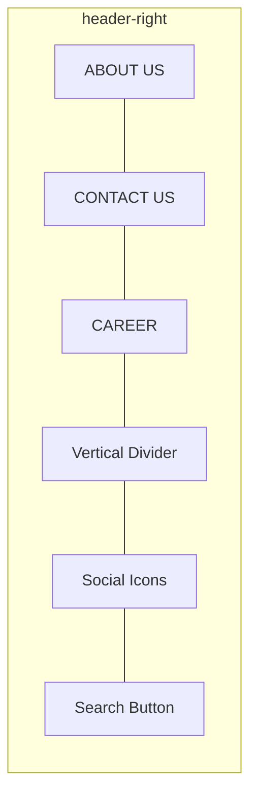

# Plan: Update Navbar to Match Reference UI

The goal is to update the top navbar (header) to match the styling shown in the second reference image provided by the user.

## Key Differences Identified
- **Social Icons**: Remove dark background squares; use plain icons with dark color.
- **Vertical Divider**: Add a vertical separator between the navigation links (CAREER) and the social media icons.
- **Spacing**: Increase spacing/gaps in the right side of the header for better balance.
- **Weather Icon**: Ensure the weather icon and layout match the "cleaner" look.

## Proposed Component Structure (header-right)

## Actionable Steps

### 1. File Backup
- Create backup copies of `tv19/src/Navbar.tsx` and `tv19/src/Navbar.css`.

### 2. Update `tv19/src/Navbar.tsx`
- Insert a `

` between the Link for `CAREER` and the `social-icons` container.

### 3. Update `tv19/src/Navbar.css`
- **Social Icons**:
    - Modify `.social-icon-box` to remove `background`, `border-radius`, `width`, and `height`.
    - Change `color` to a dark grey/black (`#333`).
    - Adjust hover effects to only change the icon color (e.g., to the brand orange `#e8380d`).
- **Vertical Divider**:
    - Add styles for `.vertical-divider`: `width: 1px`, `height: 24px`, `background-color: #ddd`.
- **Spacing**:
    - Update `.header-right` gap to `1.5rem` or more as needed.
    - Adjust margins/paddings for the links and icons.

### 4. Verification
- After implementation, I will request the user to verify the changes, preferably through a screenshot or by checking the live preview if available.

Does this plan look correct to you? If so, I will proceed with the execution.
